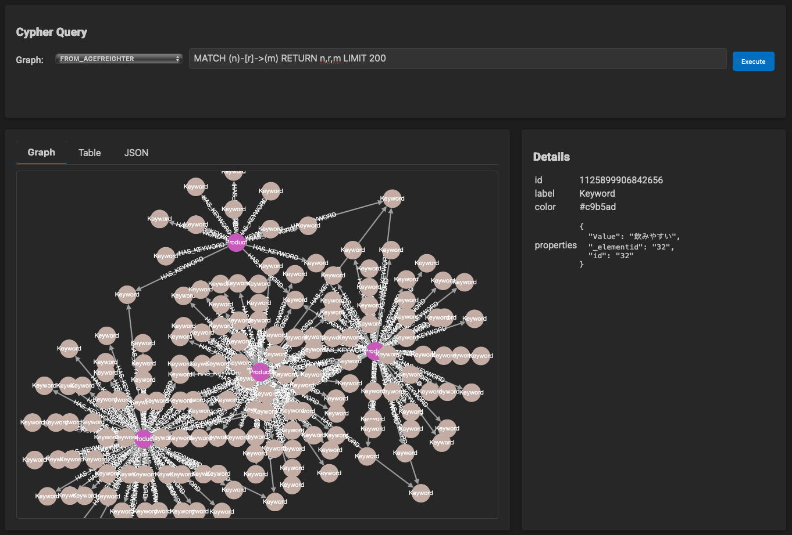

# Deep Researchで収集した商品のイメージをグラフデータに変換する

## これは何？

Deep Researchに商品名を提示し、それぞれの商品に対して消費者が持っているイメージを、キーワードで列挙させたデータをまず作成します。
[サンプル](asahi_image.txt)は、アサヒビールのビール系商品24件について、Deep Researchにキーワードを収集させています。

```
1. アサヒスーパードライ
キレのある辛口 – シャープな飲み口で、強い苦味や甘味を残さず「淡麗辛口」を実現。喉越しの良さとクリアな後味が特徴です。
すっきりした後味 – イヤな余韻がなく、後味は非常にクリア。飲んだ後にも爽快感が残り、何杯でも飲めるとの声が多いです。
コクは控えめ – 深いコクよりも軽快さを重視した味わいで、「旨味よりキレ」という印象があります。その分クセがなく食事の邪魔をしません。
飲みやすい定番 – ビール特有の苦味が強すぎず、軽やかでゴクゴク飲める安定の一本。ビール初心者からベテランまで「とにかく飲みやすい」と評判です。
食事に合う – 油っこい料理とも相性抜群で「料理を引き立てるビール」として支持されています。辛口でキレが良いため、様々な料理のお供に選ばれています。

2. アサヒスーパードライ 生ジョッキ缶
泡立ちの楽しさ – 缶を開けるときめ細かい泡が自動的に湧き上がり、生ビールさながらの体験に驚きとの声。開けた瞬間に溢れる泡に「まるで居酒屋気分！」との感想が多数です。
...
```

次にファイルの内容を[main.py](main.py)で処理します。
Azure OpenAIのモデルによって名詞・形容詞・副詞を抽出し、商品名とそれらの単語をグラフデータを作成するCSVファイルに変換します。変換後は、products.csv、keywords.csv、has_keywords.csvというファイルが出力されます。

最後に、[AGEFreighter](https://github.com/rioriost/agefreighter)でPostgreSQLにグラフデータとしてロードします。PostgreSQLへの接続には、環境変数・PG_CONNECTION_STRINGを設定するか、--pg-con-str引数を指定します。

```bash
agefreighter load --source-type csv --config load.json
```

ロードの設定は、load.jsonで行っています。

```json
{
  "edge": {
    "csv_path": "has_keywords.csv",
    "type": "HAS_KEYWORD",
    "props": [],
    "start_vertex": {
      "csv_path": "products.csv",
      "id": "id",
      "label": "Product",
      "props": ["Name"]
    },
    "end_vertex": {
      "csv_path": "keywords.csv",
      "id": "id",
      "label": "Keyword",
      "props": ["Value"]
    }
  }
}
```

可視化も、AGEFreighterで行っています。

```bash
agefreighter view
```



アサヒスーパードライ、アサヒスーパードライ ドライクリスタル、アサヒ生ビール（通称マルエフ）はいずれも「飲みやすい」というキーワードで説明されることが分かります。
